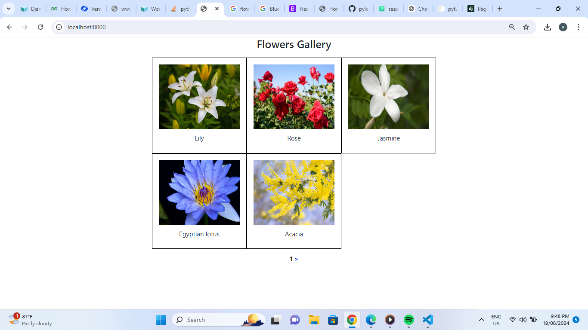

# Django Pagination

This Django project showcases the application of pagination directly on models, enabling efficient management and display of large datasets. By utilizing Django's built-in pagination functionality, the project allows users to navigate through extensive records with ease, breaking them down into manageable pages. This implementation enhances user experience by ensuring quick access to data, demonstrating how Django's powerful features can be leveraged to create scalable and user-friendly web applications.

## Documentation

You can read about pagination by clicking below.
[Documentation](https://docs.djangoproject.com/en/5.0/topics/pagination/)

## 🛠 Skills
HTML, CSS, Python, Django, Bootstrap

## Screenshots

